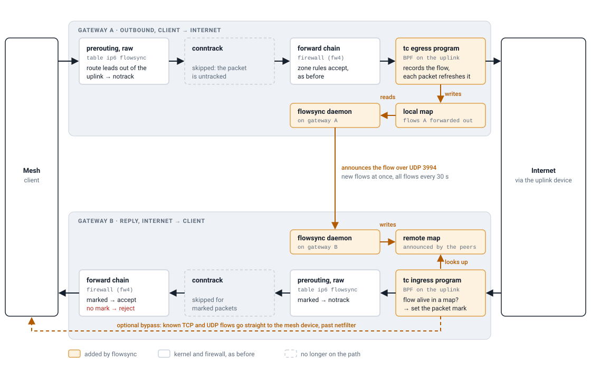

# flowsync

Stateful IPv6 forwarding for the Freifunk Berlin active-active gateways,
where a client's packets leave through gateway A and the replies enter through
gateway B. Replaces conntrackd (mode NOTRACK) + samplicator.

**Status:** builds in CI for x86_64, aarch64, mipsel and mips64 (EdgeRouter
4). Tested in a VM on x86_64, kernel 7.3. It has not run on a gateway yet.

## How it works

| piece | does |
|---|---|
| tc program, uplink **egress** | records every forwarded IPv6 flow in the **local** map; each packet out refreshes it |
| tc program, uplink **ingress** | sets a packet mark if the flow is alive in the local or the **remote** map; clears that mark bit on everything else |
| firewall | one rule in the forward chain accepts the mark; everything else from the uplink meets the stateless rules and the reject as before |
| table `ip6 flowsync` | `notrack` for marked packets and for what is routed out of the uplink: forwarded IPv6 skips conntrack |
| daemon | announces local flows to the peers over UDP (at once when new, all of them every `interval`), writes their announcements into the remote map, keeps programs and rules in place |

Properties that follow:

- **Only the client keeps a flow alive.** Packets from the server refresh
  nothing.
- **Soft state.** No acks, sequence numbers or close messages. A peer drops a
  flow `element_timeout` after its last announcement; a lost datagram is
  repaired by the next round.
- **The datapath outlives the daemon.** Programs stay attached and maps
  pinned across a stop or restart.
- **Falls back to conntrack by itself.** The outbound `notrack` only applies
  while the uplink's index is in a set whose element the daemon refreshes
  every `alive_timeout`/3 (default 10 s / 3), after checking both programs are
  attached. Daemon or programs gone: within `alive_timeout` conntrack carries
  the symmetric flows again; asymmetric ones wait. Nothing is rejected longer
  than that.
- conntrack keeps IPv4, the gateway's own traffic and mesh-to-mesh
  forwarding.

## Requirements

- Kernel 6.12 or later (tcx hooks, fib lookup with mark, refresh of a set
  element's expiry). Older kernels are not supported.
- BPF JIT on (`net.core.bpf_jit_enable=1`; status shows `jited`), bpffs at
  `/sys/fs/bpf`.
- `nft` and the nftables `fib` expression (package dependencies `nftables`,
  `kmod-nft-fib`), libbpf 1.3 or later.
- firewall4 is optional: the accept rule goes into the `forward` chain of the
  `inet` table named by `fw_table` (default `fw4`).
- Uplink qdiscs (SQM, cake, clsact of other tools) are untouched: the
  programs sit on the tcx hooks, before the device's tc filters.

## Configuration

`/etc/config/flowsync` (rendered by bbb-configs); the init script turns it
into command-line options. Minimal:

    config flowsync 'main'
        option enabled '1'
        option interface 'wan'            # sync socket and uplink
        option bind_address '192.0.2.1'   # as the peers list this gateway
        list peer '192.0.2.2'
        list prefix '2001:db8::/32'       # client prefixes to sync
        list exclude_dst '2001:db8::/32'  # the mesh itself
        list key '<32 hex digits>'        # openssl rand -hex 16

| option (UCI name) | default | meaning |
|---|---|---|
| `-I` `interface` | any | device sync datagrams are accepted on (logical name allowed in UCI) |
| `-U` `uplink` | `interface` | device the programs attach to; waited for and followed when re-created |
| `-b` `bind_address` | any | own sync address, IPv4 or IPv6; must be what the peers list |
| `-e` `peer` (list) | - | the other gateways, max. 32, one address family |
| `-p` `port` | `3994` | UDP port |
| `key` (list) / `--key-file` `key_file` | - | up to 4 keys; the first signs, all are accepted |
| `-x` `prefix`, `-X` `exclude` (lists) | - | client prefixes synced / not synced |
| `-D` `exclude_dst` (list) | - | server prefixes not synced |
| `-P` `proto` (list) | `udp tcp esp gre ipip ip6ip6 l2tp` | synced protocols (names, `sctp`, or a number) |
| `-S` `skip_server_port` (list) | `53` | UDP server ports not synced |
| `-i` `interval` | `30` | seconds between refresh rounds |
| `-t` `element_timeout` | `90` | lifetime of a peer's flow after its last announcement; at least 3 x `interval` |
| `-r` `tx_rate` | `500` | refresh datagrams per second, per peer |
| `-R` `resync_rate` | `0` | rate when answering a resync; `0` = 4 x `tx_rate` |
| `-l` `batch_lines` | `30` | records per datagram, 1..34 |
| `-B` `rcvbuf` | `8388608` | receive buffer of the sync socket |
| `-F` `max_flows` | `131072` | local map size (LRU, about 100 bytes per entry, preallocated) |
| `-C` `max_remote` | `131072` | remote map size; when full, new flows are refused |
| `udp_timeout` `tcp_timeout` `tcp_syn_timeout` `tcp_close_timeout` `other_timeout` | see "Flows" | lifetime of a local flow after its last packet out |
| `-A` `alive_timeout` | `10` | see "Falls back to conntrack" above |
| `-m` `mark` | `0x01000000` | mark of accepted packets; the fw4 include must name the same value |
| `fw_table` | `fw4` | `inet` table whose `forward` chain gets the accept rule |
| `--bypass` `bypass` | off | see "Bypass" |
| `-d` `debug` | off | log every record |

Command line only: `-s` status file (`/var/run/flowsync/status`), `-u` user
to drop to, `--bpf-object` (`/lib/bpf/flowsync.o`), `--pin-dir`
(`/sys/fs/bpf/flowsync`).

Changing `max_flows` or `max_remote` recreates that map empty at the next
start. Timeouts and mark take effect with a restart; the maps stay.

## Commands

`/etc/init.d/flowsync <command>` or `flowsync [options] <command>`:

| command | does |
|---|---|
| `run` | the daemon |
| `check` | print the parsed configuration |
| `status` | counters, per-peer state |
| `flows [local\|remote]` | list the maps, with remaining lifetime as the programs count it |
| `flow <client> <cport> <server> <sport> [proto]` | look one flow up in both maps; exit 0 if alive |
| `announce <client> <cport> <server> <sport> [proto]` | send one record to all peers |
| `bypass [on\|off]` | show or switch the bypass at runtime |
| `detach` | remove programs, maps, table and rule |

- **stop / restart:** programs and maps stay; a restart replaces the programs
  in place. Stopped for longer, the gateway is on conntrack after
  `alive_timeout`.
- **detach:** forwarded IPv6 is conntrack's again from the next packet;
  running flows have no conntrack entry until their client sends. Package
  removal runs it; an upgrade restarts the service instead.
- The daemon starts as root, then keeps only `CAP_NET_ADMIN` and switches to
  the user `flowsync`.

Status fields worth watching:

| field | meaning |
|---|---|
| `attached`, `jited`, `fw_ok`, `alive` | programs on the uplink / JIT-compiled / rule and table in place / uplink untracked. All 1 when healthy |
| `local`, `remote` | live flows per map at the last round |
| `peer <addr> rx <n> age <s> tx_errors <n>` | per peer; `age` over 3 x `interval` is logged |
| `rx_auth` | datagrams from a peer address with a missing or wrong tag |
| `rx_bad_peer`, `rx_policy`, `rx_parse` | datagrams or records dropped: unknown source, policy, malformed |
| `rx_limited` | flows refused because the remote map is full |
| `ev_overruns`, `refresh_overrun` | new-flow events lost / a round not finished within `interval` (raise `tx_rate`) |
| `fw_repaired`, `dp_attached` | how often the rule / the programs had to be put back |
| `dp_in_local`, `dp_in_remote`, `dp_in_miss`, `dp_in_bypass` | ingress: accepted on a local / a peer's flow, no flow, forwarded by the bypass |
| `loop_max_ms` | longest stall of the event loop in the last interval |

## Flows

Key: client address, server address, protocol, client port, server port.

| protocol | key | synced by default | lifetime after the last packet out |
|---|---|---|---|
| UDP | ports | yes | `udp_timeout` 180 s |
| TCP | ports | yes | `tcp_syn_timeout` 120 s (only SYNs so far), `tcp_timeout` 7440 s, `tcp_close_timeout` 120 s (after the client's FIN or RST) |
| ESP, GRE, IPv4-in-IPv6, IPv6-in-IPv6, L2TPv3 | address pair | yes | `other_timeout` 600 s |
| SCTP | ports | no | `other_timeout` |
| any other | address pair | no | `other_timeout` |
| ICMPv6 | none: stateless in the firewall | - | - |

- TCP state is two flags from the client's segments. No window tracking, and
  nothing is learned from the server.
- No helpers (FTP, SIP, ...).
- Fragments: only the first one has ports and is marked; the kernel's
  reassembly passes its mark on to the reassembled packet. Up to 6 extension
  headers are walked.

A flow is **synced** if all of these hold (checked on send and on receive):
protocol in `proto`; client in a `prefix` and in no `exclude`; server in no
`exclude_dst`; UDP server port not in `skip_server_port`; addresses routable.
A flow that is not synced still works on the gateway that forwards it.

## Sync protocol

UDP between the peers, one datagram = header + up to 34 records:

    header:  version(1)=1  count(1)  flags(1)  reserved(1)
    record:  proto(1)  flags(1)  cport(2)  sport(2)  reserved(2)  client(16)  server(16)
    tag(8):  only with header flag 0x02

- `count` 0 is a heartbeat, sent every `interval`. Header flag `0x01` asks the
  receiver for a full round now (resync).
- A gateway asks for a resync at start, when its sync socket was reopened,
  and when a peer is heard again after more than 1.5 x `interval` of silence.
  Answers are rate-limited per peer.
- **Authentication** (flag `0x02`): with a key, every datagram carries
  SipHash-2-4 over header and records, and untagged or wrongly tagged
  datagrams are dropped. Same key on all gateways. To rotate, add the new key
  behind the old one everywhere, swap, then drop the old one. Keys come from
  `FLOWSYNC_KEY` in the environment (the init script sets it from UCI) or
  `--key-file`, never from the command line.
- Not covered by the tag: replay of a recorded datagram, and telling gateways
  apart.
- Without a key, a peer is whoever sends from a peer's address on the
  `interface` device.

## Firewall rules

Both are kept in place by the daemon (checked on ruleset changes).

    table ip6 flowsync {
        set alive { type iface_index; flags timeout; }
        chain prerouting {
            type filter hook prerouting priority raw; policy accept;
            meta mark & 0x01000000 == 0x01000000 notrack accept
            fib daddr oif @alive notrack
        }
    }

    # in the firewall's forward chain
    meta nfproto ipv6 meta mark & 0x01000000 == 0x01000000 accept comment "flowsync"

- The accept must be in the chain that rejects; an accept in our own table
  would not override it.
- With fw4 the rule comes from the include
  `/usr/share/nftables.d/chain-pre/forward/10-flowsync.nft`. If it is missing
  or names another mark, the daemon inserts or replaces it (`fw_repaired`).
  Keep `mark` and the include in step.
- It is placed before the `ct state` rule and behind prepended rules such as
  the MSS clamp, which a SYN/ACK must still pass.
- `drop_invalid` must stay off.
- Keep the stateless ACK/RST accept: it carries replies that arrive before
  the announcement, and the first seconds after a reboot.

## Bypass

Off by default. With it, the ingress program forwards accepted plain TCP and
UDP packets itself (route lookup, hop limit, redirect), past nftables and the
kernel's forwarding path. Uplink to mesh direction only. SYN/FIN/RST,
fragments, extension headers, other protocols, hop limit 1, oversized packets
and packets without a route take the normal path.

VM measurement, per packet at 10k flows: bypass 0.72 µs, conntrack 0.79 µs,
flowsync without bypass 0.96 µs, empty ruleset 0.64 µs.

Costs:

- Firewall rule changes do not reach running flows until they end.
- Bypassed packets skip ingress shaping (SQM's IFB) and the forward chain's
  counters; `dp_in_bypass` counts them.
- The uplink must be Ethernet-like. Policy routing on marks that nftables
  sets in prerouting is not seen.

## Migration from conntrackd

The two cannot read each other's datagrams. While the fleet is mixed, an
asymmetric flow between a migrated and an unmigrated gateway has no state on
the reply side (one of six migrated: 33 % of asymmetric flows; three of six:
60 %). So switch all gateways within minutes:

- flash all images back to back, or
- ship both packages with flowsync `enabled '0'`, then stop conntrackd and
  samplicator and start flowsync everywhere by script.

Nothing is cut at the first start: a flow moves from conntrack to the maps
with its next packet out. Rollback: `detach`, then start conntrackd.

bbb-configs has to provide:

- the options above, with `key` from a secret;
- an input rule for UDP 3994 from the peers on the uplink zone;
- a drop for forwarded UDP to the peers' sync port from the mesh, or any mesh
  host behind a masquerading gateway can pose as a peer.

## Known limits

- A reply can arrive before the announcement; see the ACK/RST accept above.
- No TCP state on the reply gateway: any segment with the 5-tuple passes while
  the flow lives.
- Closed or abandoned connections linger up to their timeout. A full local
  map evicts the longest-idle flows.
- `max_remote` refuses in arrival order; there is no per-client limit.
- No flow offloading for forwarded IPv6.
- The outbound `notrack` decides by destination route in the main table.
  Source-based policy routing that sends clients out of another device
  untracks the wrong packets.
- Adding or removing a gateway means re-rendering all of them.

## Not verified yet

- Anything on a gateway: kernel 6.12 at runtime, the MIPS64 JIT, per-packet
  cost, the bypass gain.
- Whether the gateways route forwarded traffic by source (see "Known
  limits").
- Running next to sqm-scripts on a device (tested against an ingress qdisc
  with IFB redirect in the VM).
- The mark of a reassembled packet is kernel behaviour read from the source,
  not a documented interface; dptest `frag_*` covers it.

## Source and tests

| file in `src/` | content |
|---|---|
| `bpf/flowsync.bpf.c`, `dp.h` | the two programs; map layouts shared with the daemon |
| `dp.c` | load, attach, pinned maps, events, map walks |
| `fw.c`, `nfnl.c` | the rules; the heartbeat element over netlink |
| `tx.c`, `rx.c`, `resync.c` | announcements and rounds; receiving; heartbeats and resync |
| `wire.c`, `siphash.c`, `udp.c` | datagram format, tag, socket |
| `policy.c`, `config.c`, `status.c`, `main.c` | as named |

    make -C src test       # unit test, no kernel needed
    make -C src dptest     # datapath scenarios (flow tables, rules, fragments, bypass)
    make -C src itest      # gwlab: a fleet of gateways with real traffic
    make -C src check      # all three

dptest and itest need root, or run in a throwaway VM via virtme-ng (`VNG=`).
See [test/dptest/README.md](test/dptest/README.md) and
[test/gwlab/README.md](test/gwlab/README.md). The earlier conntrack-based
version is on branch `flowsync-conntrack`.
